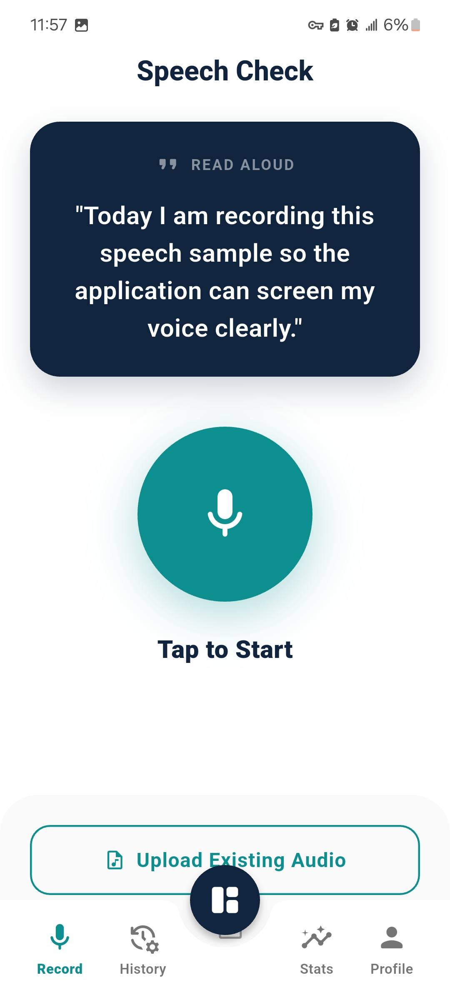
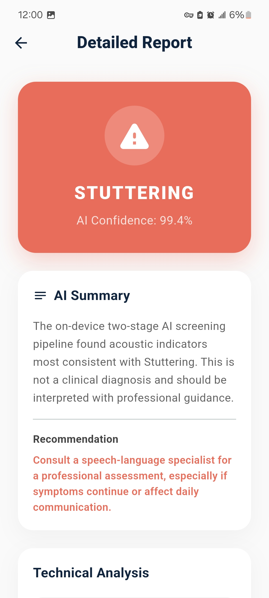
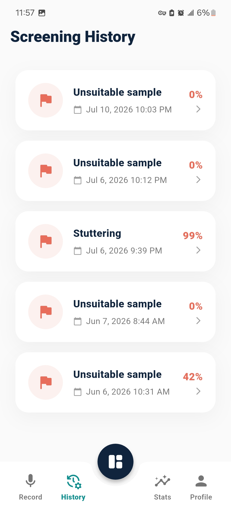
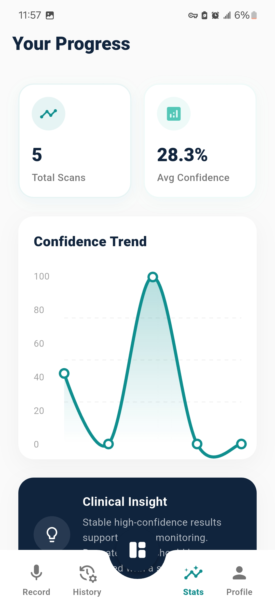
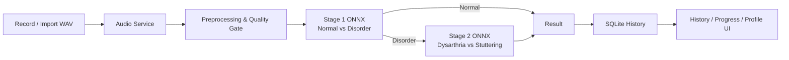

# SpeechCare — AI-Based Early Screening for Dysarthria & Stuttering

> A Flutter mobile application for privacy-conscious, on-device early speech screening using a two-stage ONNX inference pipeline.

[](https://flutter.dev)
[](https://onnx.ai)
[](https://sqlite.org)
[](https://github.com/Abdulrahman-Alsebaeai)

## Overview

SpeechCare is an Arabic/English Flutter application designed to support **early screening** for speech patterns associated with dysarthria and stuttering. The application records or imports WAV audio, validates and preprocesses the sample, performs a two-stage ONNX inference flow on the device, stores screening history locally, and presents probabilities, confidence, recommendations, and progress views.

> **Medical disclaimer:** This software is an educational early-screening project. It is **not a medical diagnosis** and must not replace evaluation by a qualified speech-language professional.

## Key Features

- On-device ONNX inference; no cloud backend is required for the default AI path.
- Two-stage classification: **Normal vs Speech Disorder**, then **Dysarthria vs Stuttering** when Stage 1 identifies a disorder pattern.
- WAV recording/import with 16 kHz mono preprocessing and audio-quality checks.
- Local authentication and screening history backed by SQLite.
- PBKDF2-SHA256 password hashing with migration support for legacy hashes.
- English and Arabic localization with RTL support.
- Result details, probability visualization, history, progress, and profile/settings screens.
- Optional remote API mode and an explicit development mock mode controlled through compile-time flags.

## Screenshots

<p align="center">
  
  
  
  
</p>

## Architecture



## Technology Stack

| Area | Technology |
|---|---|
| Mobile | Flutter, Dart |
| State | Provider |
| AI inference | ONNX Runtime |
| Audio | `record`, WAV preprocessing |
| Local persistence | SQLite / `sqflite` |
| Networking | Dio (optional backend mode) |
| Charts | `fl_chart` |
| Localization | Flutter localization, Arabic RTL + English |

## Model Artifacts

The trained ONNX binaries are intentionally excluded from Git because of their size. Before real inference, place these files in `assets/models/`:

```text
assets/models/model1_normal_vs_disorder_best.onnx
assets/models/model2_dysarthria_vs_stuttering_best.onnx
```

See [`assets/models/README.md`](assets/models/README.md) and [`lib/README_ON_DEVICE_MODEL_SETUP.md`](lib/README_ON_DEVICE_MODEL_SETUP.md).

The included export metadata describes a two-stage **Wav2Vec2 + BiLSTM + Attention** model pipeline and the 16 kHz audio configuration.

## Getting Started

### Requirements

- Flutter SDK compatible with Dart `^3.7.2`
- Android Studio / Android SDK for Android builds
- The two ONNX model files above for real on-device inference

### Run

```bash
flutter pub get
flutter run
```

The default runtime configuration uses on-device AI. Useful compile-time flags include:

```bash
flutter run --dart-define=USE_ON_DEVICE_AI=true --dart-define=USE_MOCK_AI=false
```

For a remote inference backend:

```bash
flutter run \
  --dart-define=USE_ON_DEVICE_AI=false \
  --dart-define=API_BASE_URL=http://10.0.2.2:8000
```

## Project Structure

```text
lib/
├── core/          # Theme and shared app concerns
├── l10n/          # English/Arabic localization
├── models/        # Domain models
├── screens/       # App screens
├── services/      # Audio, auth, database, preprocessing, AI inference
├── state/         # Application state
└── widgets/       # Reusable UI components
assets/models/     # Model metadata + local ONNX placement
docs/screenshots/  # Portfolio screenshots
```

## Privacy & Safety Notes

- The normal on-device path keeps inference local to the device.
- Screening history is stored locally in SQLite.
- The project intentionally distinguishes screening from clinical diagnosis.
- Large model binaries and credentials should never be committed directly to the repository.

## Author

**Abdulrahman Al-Sebaeai** — Computer Science / Software & AI Projects  
GitHub: [@Abdulrahman-Alsebaeai](https://github.com/Abdulrahman-Alsebaeai)

## License

Copyright © 2026 Abdulrahman Al-Sebaeai. All rights reserved. See [`LICENSE`](LICENSE).
